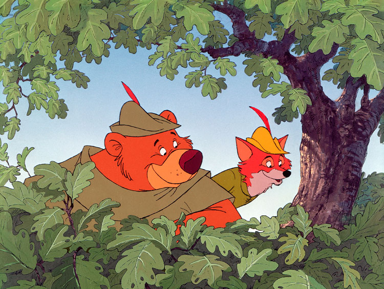
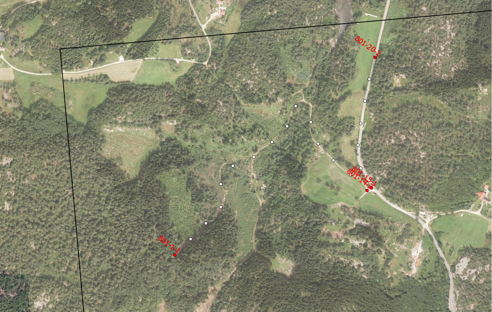
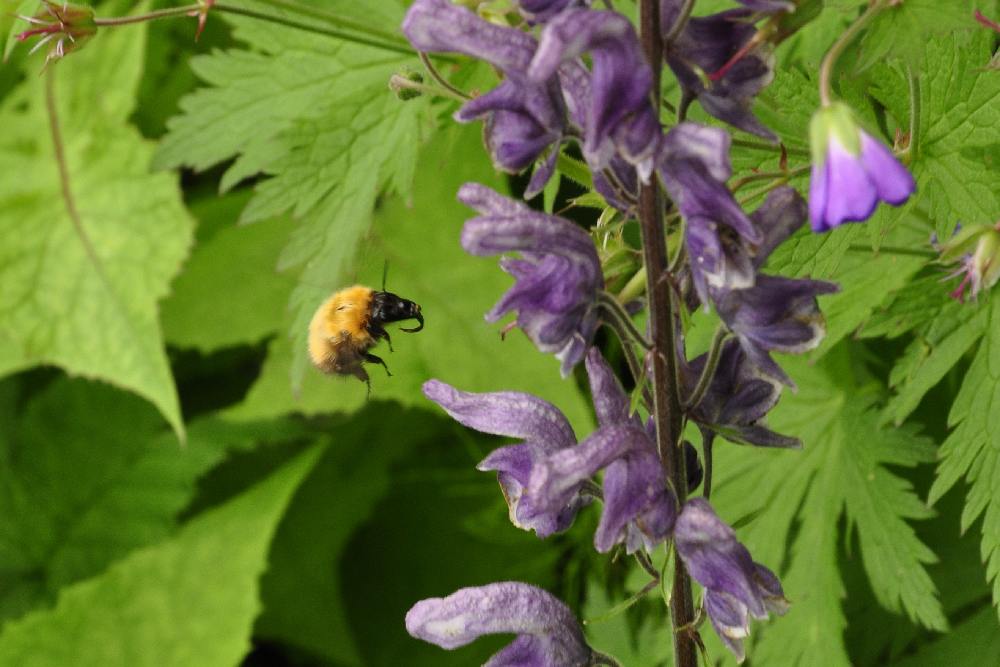

```{r setup, include=FALSE}
require(knitr)
knitr::opts_chunk$set(echo = FALSE)
require(tidyverse)
require(jsonlite)
```

Where should I put my ecological data set?
=========

Making your data publicly available is quickly becoming a standard task for researchers. It is increasingly demanded by journals when publishing your research findings, or even by funding agencies when applying for grants. Journals have traditionally accepted data in file format, which can be reached through their websites along with the paper. But these data have idiosyncratic formats and are typically stripped down to a minimal set suited for a specific analysis in the paper. In addition, the data can be hard to find and cumbersome to download, since it is stored (or should I say hidden) behind paywalls on various publishers' websites.

Wouldn't it be nice if we could store our ecological data using a common format, in a common place, freely available for everyone?

GBIF could be your solution. It doesn't work for every sort of biological data, but it probably works for more cases than you would think. 

-But my data have a complex structure with repeated measurements and zero-counts that GFIB just can't accept, you might say. 

Well let's see about that. With the new(ish) "Event Core" of the Darwin core standard, odds are that GBIF works for your data as well. Below is the story of how I formatted and published a multi-year observation data set of ~80 species with a hierarchical survey scheme, while incorporating all collected environmental covariates, and meta-data into GBIF.


The Event Core standard
============
GBIF — the Global Biodiversity Information Facility, is a vast store of biodiversity data, with records spanning hundreds of years, and containing hundreds of millions of occcurrence records. Up until recently though, it has been limited to presence-only data, neglecting information of possible zero-counts. The addition of Events to the Darwin Core standard seeks to remedy that. With this addition, GBIF now accepts most survey data. It does this by organizing the data around individual sample events, i.e. a distinct measurement event of one or more species together with related records, in a specific time and place.

See here for info on the Darwin core in general: <https://www.gbif.org/darwin-core>. For event-data specifically, see here: <https://www.gbif.org/data-quality-requirements-sampling-events>.

From a custom sample structure to a standardized hierarchy of events
------------------------
Most of our complex data has a structure to it, whether it is spelled out clearly through naming schemes, or implicit through  relationships within a database. A botanist for example, might have mapped the flora of a forest stand by placing 1$m^2$ survey squares randomly 10 times, and recorded the percentage cover of each species in the squares. The individual observations of the plants are then linked together through the specific 1$m^2$ survey square they were found in, and further linked together through the 10 survey squares in the same forest stand. This could be recorded in a single table by using a column for the names of the forest stand, a column for the survey square a column for the plant species and a column of the percentage cover of the species (Table 1). Or, the data could be split up into separate tables in a database, with keys that link the tables together. Alas, there are (almost) as many potential structures as there are surveys. But there is only one Darwin Event Core. The task is then to standardise individual data sets so that it fits into GBIF, while providing the necessary information so that the original format can later be retrieved. It's a little bit like zipping and unzipping a file.

The key idea behind the event core format is to link related information in a data set together using a hierarchy of recording events. The lowest level **event** in our example is the counting of plants within one survey square. That's the smallest observational unit that links individual records together. Each such event has a number of **occurrence** records linked to it, in this example the percentage cover of each plant in that survey square. This can include values of 0%, for species that we looked for, but didn't find in any particular survey square. We can also include zero counts the same way. The hierarchical structure of the survey scheme is recorded by encoding the higher recording level, above the observation event as a **parent event**. In our case this is the survey of the entire forest stand. This hierarchy is open-ended, meaning there could be additional higher level events. Thus a parent event can have it's own parent event, and so on. 

The point of coding the hierarchical relationships this way is to be able to store any (?) structure and related recorded data in a standardised way, in only one event table and one occurrence table. This obviously has some major benefits. We could store a wide range of biodiversity data in a unified way at a single location, facilitating the combination of data sources and streamlining data gathering routines.

But nothing so great comes for free, and the cost here is that you might need to rearrange your data before you upload it to GBIF. This particular formatting can seem confusing at first, and along the way you might wonder if it's really worth it. But there is no way around it. There is inherently work involved in organizing complex data into a unified format and getting it back again. But once it's done, your data is securely stored and publicly available, free of charge, in the worlds largest repository of biodiversity information. 


A simple example
----------------
Let's look at our made up example data of plant surveys in forests.

```{r}
set.seed(1234)
exampleData <- tibble("date" = rep(c("2019-04-01", "2019-04-15"), each =  6),
                      "observer" = rep(c("Mary", "John"), each = 6),
                      "forest" = rep(c("Sherwood", "Nottingham"), each = 6),
                      "plot" = rep(rep(paste0("plot_", 1:2), each = 3), 2),
                      "pH" = rep(round(runif(n = 4, min = 6, max = 8), 2), each = 3),
                      "species" = rep(c("Quercus robur", "Anemone nemorosa", "Athyrium filix-femina"), 4),
                      "percCover" = round(runif(n = 12, min = 0, max = 40), 2))


```

```{r}
kable(exampleData, 
      caption = "Made up simple example data.")
```

```{r layout="l-body", fig.cap = "Rare footage of early botanists."}

```

Using the Event Core format, this could be transformed into something like these two tables, which GBIF can swallow.

```{r}
pH <- paste0("{\"pH\" : ", c( unique(exampleData$pH)), "}")

exampleEvent <- tibble("eventDate" = rep(unique(exampleData$date), each = 3),
                      "eventID" = c("parentEvent_1", "event_1", "event_2", "parentEvent_2", "event_3", "event_4"),
                      "parentEventID" = c(NA, "parentEvent_1", "parentEvent_1", NA, "parentEvent_2", "parentEvent_2"),
                      "locationID" = c("Sherwood", "plot_1", "plot_2", "Nottingham", "plot_1", "plot_2"),
                      "dynamicProperties" = c("{\"Mary\"}", pH[1:2],"{\"John\"}" , pH[3:4])
                      )


```
```{r}
exampleOcc <- tibble("eventID" = rep(paste0("event_", 1:4), each = 3),
                     "scientificName" = exampleData$species,
                     "organismQuantity" = exampleData$percCover,
                     "organismQuantityType" = "percentageCover")

```


```{r}
kable(exampleEvent, caption = "Minimal example of Event table for made up data.")
```

```{r}
kable(exampleOcc, caption = "Minimal example of Occurrence table for made up data.")
```

Notice that the individual survey squares are tied to a common forest survey through the parentEventID column in the event table. Additional environmental data (here pH and observer) is stored in a column named "dynamicProperties", which is formated as JSON, and can hold any collection of such extra information. The result is perhaps less readable for a human, but the structure is generalizable to a lot of situations.


Butterfly and bumblebee example
==============
I will now show how we formatted a real world data set for publication on GBIF through the Event Core standard. The data comes from a yearly survey of butterfly and bumblebees at approximately 60 fixed locations in Norway. We employ citizen scientists to record the abundances of butterflies and bumblebees along 20 50 meter long pre-defined transects at each survey location. Each location is visited 3 times each year, and rudimentary environmental data is recorded at each transect, each visit. We train each surveyor to be able to identify all occurring species, and thus record non observed species as zero counts. 

```{r layout="l-body", fig.cap = "One of the survey squares with its 20 transects á 50m"}

```


Here, each transect walk along the individual 50 meter transects form the lowest level observation event. Within each of these transect walks, each species can be observed 0 or more times. The 20 transects are clustered together within a larger survey square of 1.5x1.5 kilometers and together characterize the bumblebee and butterfly communities at these locations. We therefore can format the data into one table of **occurrences**, and one table of events, including the transect walks as the lowest level **events** and the survey square visits as **parentEvents**. 


In the toy example above, we used readable id's for the sampling units (Sherwood, plot_1, etc.) for pedagogical reasons, but it is good practice to use unique identifiers whenever possible in your real data. Thus in our example, every event, parent event, and location is replaced with a UUID, which is stable throughout time. In our case, we might relocate transect nr 5 in a survey location due to practical reasons, but keep the name of "transect 5". But this transect then gets a new unique identifier, making it possible to distinguish the new and old locations.
 

```{r}
download = F
```

```{r}
datasetID <- "aea17af8-5578-4b04-b5d3-7adf0c5a1e60" ##From the webpage URL
datasetURL <-  paste0("http://api.gbif.org/v1/dataset/",datasetID,"/endpoint")
dataset <- RJSONIO::fromJSON(datasetURL)
endpoint_url <- dataset[[1]]$url # extracting URL from API call result
```

```{r, eval = download}
# Download from dwc-a from IPT  putting into data folder
download.file(endpoint_url, destfile="GBIF_data/gbif_download.zip", mode="wb")

```

```{r, eval = download}
unzip("GBIF_data/gbif_download.zip",
      exdir = "GBIF_data")
```


```{r}
eventRaw <- read_delim("GBIF_data/event.txt", 
                       delim = "\t",
                       locale = locale(encoding = "UTF-8"),
                       col_types = cols(id = col_character(),
  type = col_character(),
  modified = col_datetime(format = ""),
  ownerInstitutionCode = col_character(),
  dynamicProperties = col_character(),
  eventID = col_character(),
  parentEventID = col_character(),
  samplingProtocol = col_character(),
  sampleSizeValue = col_double(),
  sampleSizeUnit = col_character(),
  eventDate = col_datetime(format = ""),
  eventTime = col_character(),
  eventRemarks = col_character(),
  locationID = col_character(),
  country = col_character(),
  countryCode = col_character(),
  stateProvince = col_character(),
  municipality = col_character(),
  locality = col_character(),
  locationRemarks = col_character(),
  decimalLatitude = col_double(),
  decimalLongitude = col_double(),
  geodeticDatum = col_character(),
  coordinateUncertaintyInMeters = col_double(),
  footprintWKT = col_character(),
  footprintSRS = col_character()
))
```


```{r}
occurrenceRaw <- read_delim("GBIF_data/occurrence.txt", 
                       delim = "\t",
                       locale = locale(encoding = "UTF-8")
                       )

```

```{r}
subsetEvent <- eventRaw %>% 
  filter(parentEventID == eventRaw$eventID[1]) %>% 
  slice(1)

subsetParentEvent <- eventRaw %>% 
  slice(1) 

subsetEventComb <- subsetParentEvent %>% 
  bind_rows(subsetEvent)

```

The event table
----------
This is how two rows of our entire event table looks like as a tibble, showing one parent event (survey square visit) and one of it's children events (transect walks). 

```{r}
subsetEventComb
```
The first 5 columns records the record id, the type of record, the latest time the data was modified, the owner of the data and additional "dynamic properties". Like in the toy example above, the dynamic properties contain various data that is tied to the observation event, that doesn't have their own predefined GBIF columns. For our data set, this includes the person who recorded the observation, the local habitat type, cloud cover, temperature, and the local flower cover. This is concatenated into a JSON-string, in order for the GBIF database to be able to accept various formats. In our data, we don't have any dynamic properties (extra information that GBIF lacks columns for) that are tied to the parent event (larger survey square level). It is for example possible to have two observers sharing a survey square by dividing up the transects withing it (although uncommon). I imagine one could replicate any dynamic properties of the parent event down to the child events if one would like, but that would result in unecessary data size, and less clarity of the hierarchical nature of the data. This is what our whole string of dynamic properties looks like:

```{r}
subsetEventComb %>% 
  select(dynamicProperties) %>% 
  slice(2) %>% 
  kable()
```

```{r layout="l-body", fig.cap = "Pollinator survey along a transect. Photo: Sondre Dahle."}

```

Next we have the eventIDs, parentEventIDs, sampling protocol, sample size and sample size unit. Note that the eventID for the parent event (the survey of the whole 1.5x1.5km square) is recorded in the parentID column for the respective "child-events", i.e. the individual transect walks. Notice also that the sampleSizeValue records the full sample size at that level, where twenty 50 meter long transects combine to make one 1000 m long parent event.

```{r}
subsetEventComb %>% 
  select(eventID,
         parentEventID,
         sampleSizeValue,
         sampleSizeUnit) %>% 
  kable()
```
The next colums is eventDate, eventTime, and a remark for the observation level, where information about the hierarchical levels can be noted. Note that the eventTime includes both start and end times, where the parent event shows the start of the first transect and the end of the last transect, whereas the child event shows the start and end time of that individual 50 m transect walk. For this data set, the event time varies according to how many insects that were registered (and potentially handled for identificaton), but the walking speed when not handling a specimen is fixed, ensuring a fixed sampling effort.

```{r}
subsetEventComb %>% 
  select(eventDate,
         eventTime,
         eventRemarks) %>% 
  kable()

```

The next columns include data on the survey location, where the parent id has coordinates for the whole polygon that make up the survey square, and the child event has coordinates for the linestring that constitutes the transect walk. We won't show all columns here.

```{r}
subsetEventComb %>% 
  select(locationID,
         footprintWKT) %>% 
  kable()

```

The occurrence table
--------
Now for the actual occurrence data, shown again as the two first rows of a tibble. 

```{r}
subsetOccurrenceRaw <- occurrenceRaw %>% 
  filter(eventID == subsetEventComb$eventID) %>% 
  slice(2)
```
```{r}
subsetOccurrenceRaw
```

The first 4 columns include a record id, a last modified record, basis of record and a unique occurrence ID.

```{r}
subsetOccurrenceRaw %>% 
  select(1:4) %>% 
  kable
```

```{r layout="l-body", fig.cap = "Bombus hortorum on a Trifolium repens."}

```

The next 5 include information of the individual count, sex of the individual (which we don't record), life stage, occurrence status (present/absent), and the eventID, which links the data back to the event table.

```{r}
subsetOccurrenceRaw %>% 
  select(5:9) %>% 
  kable
```
The next colums include taxonomic information, with the possibility to include a URL for the species and a local vernacular name. Not all columns are shown. If you are interested, pictures of the species is available at the URL by clicking "Les mer om taksonet".

```{r}
subsetOccurrenceRaw %>% 
  select(10:14, 19) %>% 
  kable
```

```{r layout="l-body", fig.cap = "Bombus consobrinus approaching an Aconitum lycoctonum."}

```

Uploading and downloading data
===========
So that's it in a nutshell for the formatting of the data. We have managed to encode all our recorded data in a quite complex survey scheme, including zero counts, into GBIF. The next step is to provide the relevant metadata, and upload the data to the GBIF. Note that GBIF only accepts data through their partner organisations, so you will have to find your nearest GBIF affiliate and send it through there. These organizations typically push data to GBIF through a specific tool called an IPT. Our organisation for example hosts its own IPT. For more information on publishing, see <https://www.gbif.org/publishing-data>, where you can also find excel templates for event core data.

The data set that were featured here is available at <https://www.gbif.org/dataset/aea17af8-5578-4b04-b5d3-7adf0c5a1e60>.

And back again?
---------------
Once the data is stored on GBIF, it can be downloaded through their standard tools. Recreating the original structure of course also requires some work, and it is adviced that you publish a recipe specific to your data, that you can refer users to. Such a recipe for our example data is available at <https://github.com/jenast/NBBM_data_export/blob/master/NBBM_GBIF_to_BMS_export.md> 

A last word of advice
-------------
At the moment, there doesn't exist much prepackaged tools that help with the formatting of these type of data, so it will most likely be a custom job for your case. Of course, if you plan on submitting your data to GBIF in this way, the earlier you set up your data structure to harmonize with GBIF, the easier it will be. That could be e.g. storing event ID's and parent event ID's along with your readable survey and location codes. At some point, you will probably have to merge an event table together with one or more parent event tables, as you are unlikely to store this together from the outset. The key thing is to keep track of the event and parent event ID's so that they codify the dependence structure of the data set. Hopefully there will be some custom tools for this type of work developed in the future, for example as an R-package. 

For our data set, we already had the data in a PostgreSQL database. After inserting some additional data that GBIF required and sorting out some relationships in the database, it was a matter of setting up views that formatted the data into the GBIF event core format. Once that was done, we set up permissions so that the IPT machine could access these export views directly, to streamline the publishing pipeline. Future additions to the data should then go smoothly.


